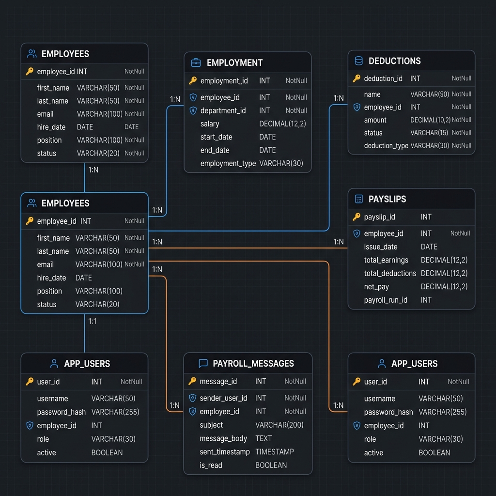
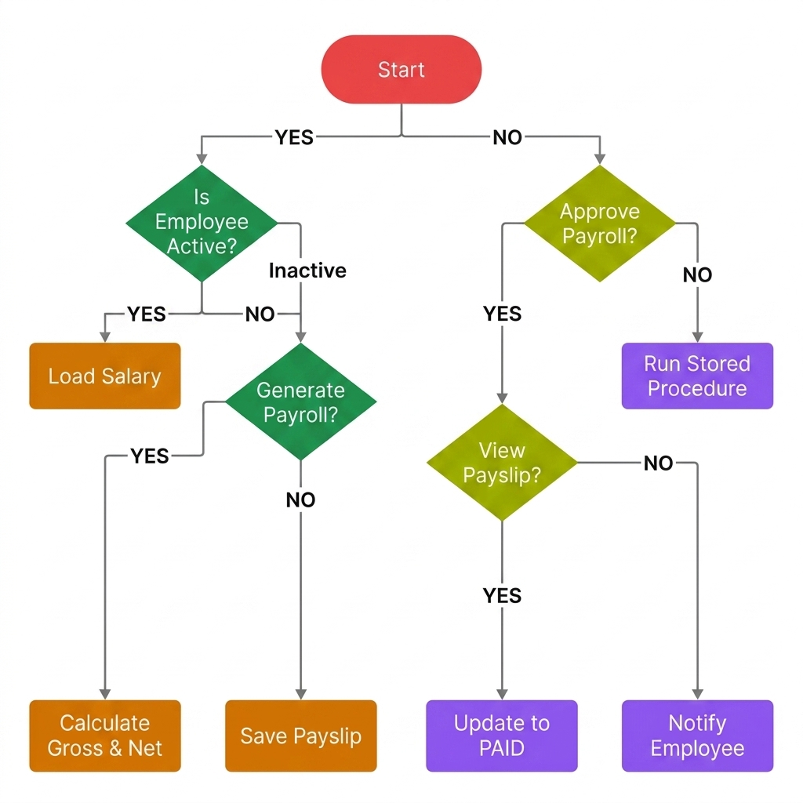
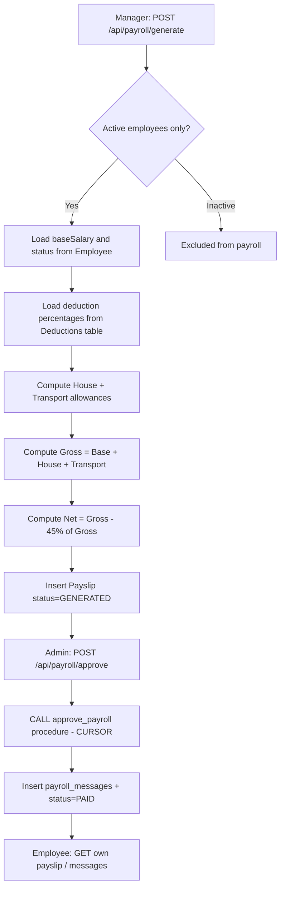

# Enterprise Payroll Management System (Backend)

Government of Rwanda ERP — Employee Management and Payroll Management modules built with **Java 17**, **Spring Boot 3**, **Spring Data JPA**, and **PostgreSQL**.

## Prerequisites

- Java 17+
- Maven 3.9+
- Docker (for PostgreSQL) or a local PostgreSQL instance

## Quick Start

### 1. Start PostgreSQL

```bash
docker-compose up -d
```

### 2. Run the application

```bash
mvn spring-boot:run
```

### 3. Open Swagger UI

http://localhost:8080/swagger-ui.html

## Database ERD



<details>
<summary>View Mermaid Code Block</summary>

```mermaid
erDiagram
    EMPLOYEES ||--|| EMPLOYMENT : has
    EMPLOYEES ||--o{ PAYSLIPS : receives
    EMPLOYEES ||--o{ PAYROLL_MESSAGES : notified_via
    EMPLOYEES ||--o| APP_USERS : linked_to
    PAYSLIPS ||--o| PAYROLL_MESSAGES : triggers

    EMPLOYEES {
        bigint id PK
        varchar first_name
        varchar last_name
        varchar names
        varchar email UK
        decimal base_salary
        varchar status
        varchar district
        varchar mobile
        date date_of_birth
    }

    EMPLOYMENT {
        bigint id PK
        bigint employee_id FK UK
        varchar emp_code UK
        varchar department
        varchar position
        decimal salary
        varchar status
        date joining_date
    }

    DEDUCTIONS {
        bigint id PK
        varchar name UK
        decimal percentage
        varchar category
        boolean active
    }

    PAYSLIPS {
        bigint id PK
        bigint employee_id FK
        decimal base_salary
        decimal house_allowance
        decimal transport_allowance
        decimal gross_salary
        decimal employee_tax
        decimal pension
        decimal medical_insurance
        decimal others
        decimal net_salary
        varchar status
        int month
        int year
    }

    PAYROLL_MESSAGES {
        bigint id PK
        bigint employee_id FK
        bigint payslip_id FK
        text message_content
        int month
        int year
        timestamp created_at
    }

    APP_USERS {
        bigint id PK
        varchar username UK
        varchar password
        varchar role
        bigint employee_id FK
    }
```
</details>

**Unique constraint:** `(employee_id, month, year)` on `payslips` prevents duplicate payroll for the same employee in the same period.

## System Flow Diagram



<details>
<summary>View Mermaid Code Block</summary>


</details>

## Payroll Formulas

| Component | Formula |
|-----------|---------|
| House | BaseSalary × 14% |
| Transport | BaseSalary × 14% |
| **Gross** | BaseSalary + House + Transport |
| **Total Deductions** | GrossSalary × 45% |
| **Net** | GrossSalary − (GrossSalary × 45%) |

Payslip columns (Tax, Pension, Medical, Other) show the 45% deduction split in a 30:6:5:4 ratio for reporting.

### Worked example — Peter (EMP-001), Base = 700,000 RWF

| Field | Amount (RWF) |
|-------|-------------|
| Base | 700,000 |
| House (14%) | 98,000 |
| Transport (14%) | 98,000 |
| **Gross** | **896,000** |
| Deductions (45% of Gross) | 403,200 |
| Tax (30/45 of deductions) | 268,800 |
| Pension (6/45) | 53,760 |
| Medical (5/45) | 44,800 |
| Others (4/45) | 35,840 |
| **Net** | **492,800** |

## REST API Endpoints

### Employees — `/api/employees`

| Method | Path | Description |
|--------|------|-------------|
| POST | `/` | Create employee + employment |
| GET | `/` | List all employees |
| GET | `/{id}` | Get by internal ID |
| GET | `/by-employee-id/{employeeId}` | Get by emp code (e.g. EMP-001) |
| PUT | `/{id}` | Update employee |
| DELETE | `/{id}` | Delete employee |

### Deductions — `/api/deductions`

| Method | Path | Description |
|--------|------|-------------|
| POST | `/` | Create deduction/allowance config |
| GET | `/` | List all |
| GET | `/active` | List active configs |
| PUT | `/{id}` | Update |
| DELETE | `/{id}` | Deactivate |

### Payroll — `/api/payroll`

| Method | Path | Description |
|--------|------|-------------|
| POST | `/generate` | Generate payroll for month/year |
| POST | `/approve` | Admin approves payroll (DB procedure) |
| GET | `/payslips?month=&year=` | List payslips for period |
| GET | `/payslips/employee/{id}` | Employee payslip history |
| GET | `/payslips/employee/{id}/{month}/{year}` | Single payslip view |
| GET | `/messages/employee/{id}` | Employee notification messages |
| GET | `/messages?month=&year=` | Messages for period |

### Users — `/api/users`

| Method | Path | Description |
|--------|------|-------------|
| POST | `/` | Create user (ADMIN/MANAGER/EMPLOYEE) |
| GET | `/` | List users |

## Seeded Data

On first startup the application seeds:

**Deductions:** EmployeeTax 30%, Pension 6%, MedicalInsurance 5%, Others 4%, House 14%, Transport 14%

**Employees:**
- Peter Mugisha (EMP-001) — Finance, Active, 700,000 RWF
- Alice Uwase (EMP-002) — HR, Active, 550,000 RWF
- Jean Habimana (EMP-003) — IT, **Inactive** (excluded from payroll)

**Users:** `admin` / `manager` / `peter.mugisha`

## Sample Postman Flow

```json
POST /api/payroll/generate
{ "month": 6, "year": 2026 }

POST /api/payroll/approve
{ "month": 6, "year": 2026 }

GET /api/payroll/payslips/employee/1/6/2026
GET /api/payroll/messages/employee/1
```

## Database Routines (PostgreSQL)

Located in `src/main/resources/db/routines.sql`:

- **`approve_payroll(month, year, institution)`** — Stored procedure using a **CURSOR** to iterate GENERATED payslips, insert ERP notification messages, and set status to `PAID`.
- **`trg_payslip_insert_message`** — **TRIGGER** on `payslips` INSERT when status is `PAID` (backup path).

Message format (on approve):

> Dear \<FIRSTNAME\>, Your salary of \<MONTH\>/\<YEAR\> from \<INSTITUTION\> \<AMOUNT\> has been credited to your \<EMPLOYEEID\> account Successfully.

## Project Structure

```
src/main/java/com/gov/rwanda/erp/payroll/
├── config/          DataSeeder, DatabaseRoutineInitializer
├── controller/      REST controllers
├── dto/             Request/response objects
├── entity/          JPA entities
├── enums/           Status enums
├── exception/       Global error handling
├── repository/      Spring Data JPA repos
└── service/         Business logic + PayrollCalculator
```
